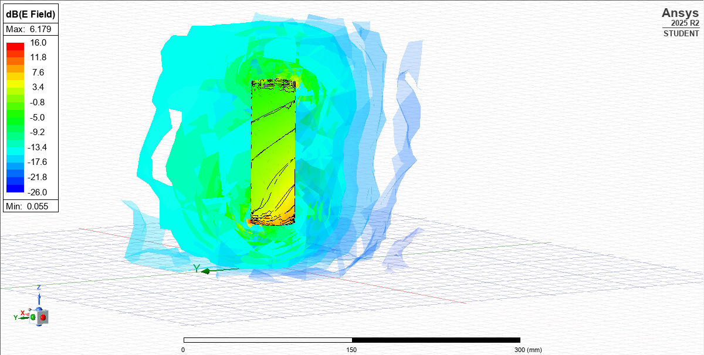
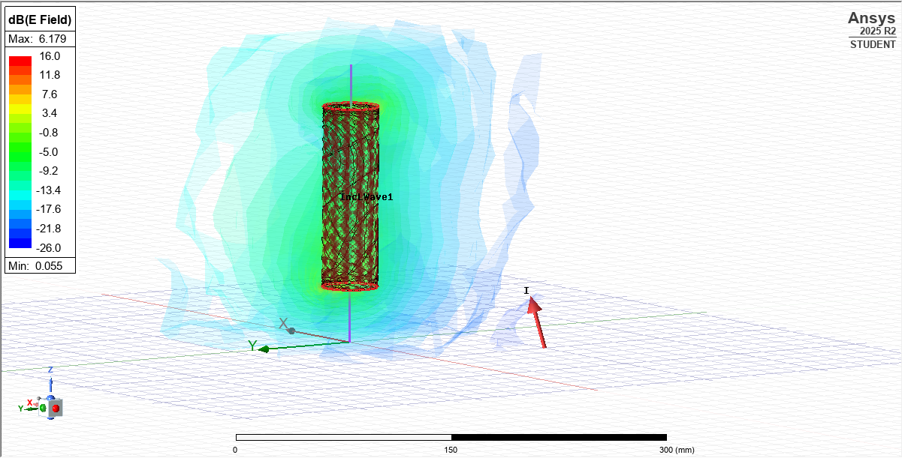
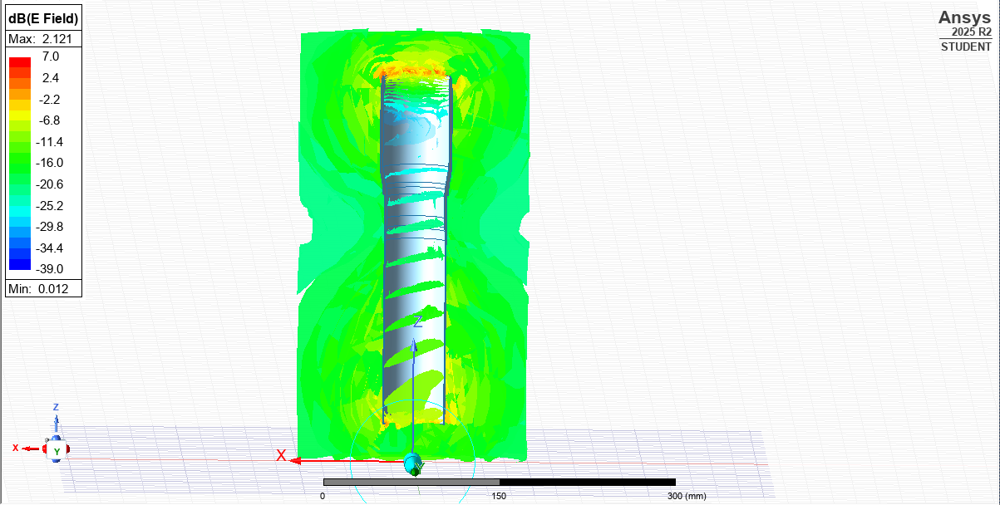
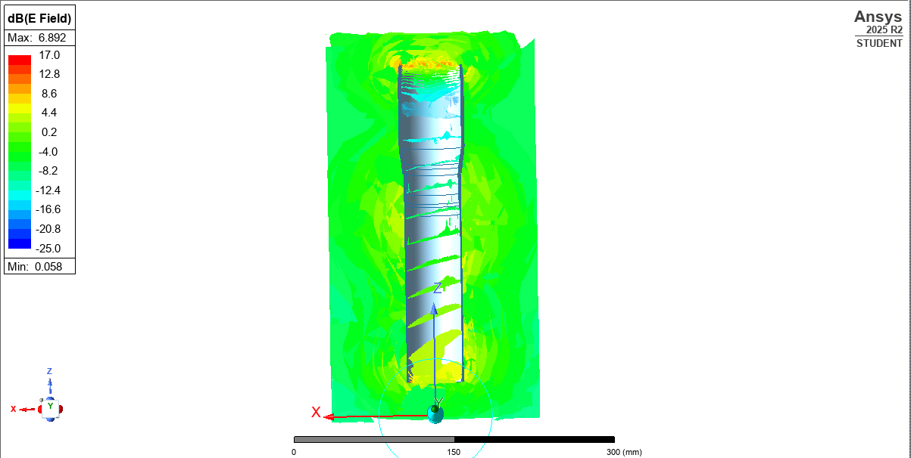
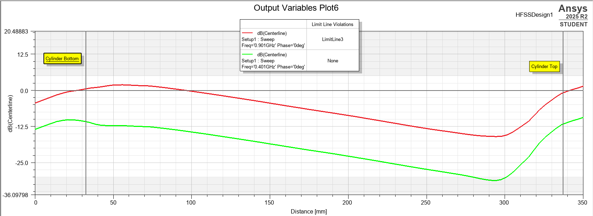

# RF Attenuation Analysis of an Aluminum Avionics Coupler

Electromagnetic simulation study conducted in **Ansys HFSS (Electronics Desktop 2025 R2)** to evaluate how housing avionics and tracking hardware inside an aluminum coupler affects radio signal strength at **401 MHz** and **915 MHz**. The results were used to validate the coupler design before manufacturing and were later confirmed through field testing at competition.

---

## Background

Our team needed to package avionics and tracking electronics inside an aluminum coupler section. Aluminum is structurally ideal but is also an RF-attenuating (and partially shielding) material, so before committing to manufacturing we needed to confirm that:

- Signal attenuation through the coupler walls would stay within an acceptable margin at both operating frequencies.
- Radio communication (telemetry/tracking) would still function reliably for the full duration of flight.

Rather than risk a hardware iteration cycle, we simulated the coupler in Ansys HFSS to predict E-field behavior and attenuation before cutting metal.

## Approach

1. **Modeling** — A simplified ("crude") representation of the coupler and internal antenna/wave port setup was built in HFSS to keep simulation time manageable while preserving the geometry that matters most for RF propagation: the cylindrical aluminum housing.
2. **Excitation** — An incident wave source was applied along the coupler's centerline to represent the onboard transmitter.
3. **Frequency sweeps** — Simulations were run at both target bands:
   - **401 MHz** (e.g., tracking system band)
   - **901 MHz** (project shorthand: ~915 MHz ISM band)
4. **Field analysis** — E-field magnitude (dB) was evaluated:
   - As a 3D volumetric field around and through the coupler.
   - Along the **XZ plane** through the coupler's centerline.
   - As a **1D line plot** from the bottom to the top of the cylinder, to directly quantify attenuation vs. distance and check it against a defined limit line.

## Simulation Setup

| Test View | Test Setup |
|---|---|
|  |  |

The model above shows the simplified coupler geometry with the incident wave excitation applied along the centerline, surrounded by the radiation/field volume used to capture the E-field distribution.

## Results

### E-Field Distribution — 401 MHz

### E-Field Distribution — 901 MHz

At both frequencies, the field is strongest near the feed point and decays as it propagates along the length of the coupler, with the aluminum housing visibly attenuating the field compared to free space — as expected for a conductive enclosure.

### Attenuation vs. Distance

This plot tracks the field level along the coupler centerline from the bottom to the top for both frequency sweeps. Both curves stayed within the acceptable range across the full length of the coupler, confirming the design met the signal integrity requirement at both bands.

## Outcome

- Simulation results showed attenuation through the aluminum coupler was within acceptable limits at both 401 MHz and 915 MHz.
- Based on these results, the team proceeded with manufacturing the coupler as designed.
- **Field validation:** at competition, live testing of the manufactured coupler confirmed the simulation predictions: radio communication from the housed devices was not significantly degraded, and all tracked components maintained signal for the entire duration of flight.

## Tools Used

- **Ansys Electronics Desktop / HFSS 2025 R2** (Student version) — 3D full-wave electromagnetic simulation
- Frequency-domain sweep analysis (401 MHz & 901 MHz)
- Output variable / limit-line plotting for pass/fail attenuation criteria

---

*This analysis was performed as part of a student engineering competition project involving onboard avionics and tracking hardware.*
